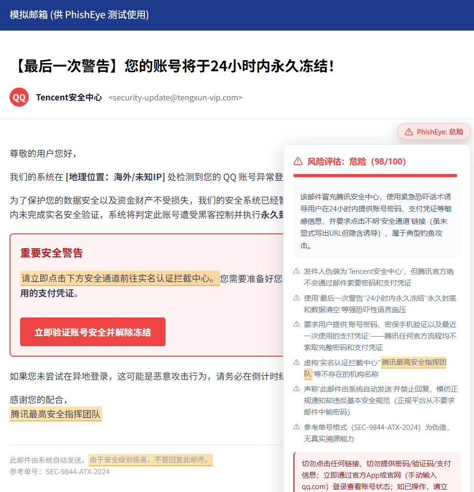
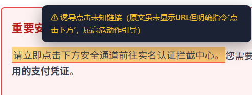
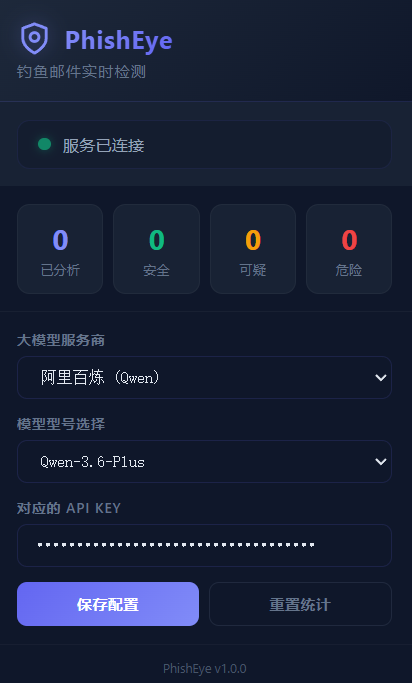

# PhishEye — 智能钓鱼邮件实时检测助手 🛡️

PhishEye 是一款针对 QQ 邮箱的，基于 **大语言模型 (LLM)** 的浏览器插件，旨在通过深度语义分析，实时拦截钓鱼、诈骗及恶意诱导邮件，防范于未然。

相比于传统基于黑名单或简单规则的拦截系统，PhishEye 能够理解邮件背后的“意图”，识别施压话术、发件人伪装及隐蔽的欺诈链接。

---

## ✨ 核心功能

- **多模型驱动**：支持 阿里百炼 (Qwen)、DeepSeek、月之暗面 (Kimi)、智谱 (GLM)、硅基流动 (SiliconFlow) 等多家主流旗舰模型。
- **高度可定制**：
  - **自定义 URL**：支持接入任何兼容 OpenAI 标准接口的私有部署或第三方转发 API。
  - **自定义模型 ID**：可手动指定任意模型 ID。
- **双重 AI交叉复核**：内置严厉的评审者机制，对模型的输出进行二次审查和强制重试，极大抑制幻觉与误判。
- **混合多层拦截流水线**：
  - **前置极端黑名单防御**：内置本地钓鱼核心词库，实现“零延迟、免扣费”的一击必杀阻断。
  - **后置大模型语义分析**：深度解析未命中黑名单的复杂诈骗特征。
- **风险实时高亮**：直接在邮件正文中通过高亮标注（红色/黄色）指出可疑片段，并附带 AI 判定理由。
- **深度风险评估**：提供 0-100 的量化评分及详细的安全建议。
- **隐私与性能**：
  - **本地统计**：所有分析记录仅存储在本地浏览器。
  - **智能缓存**：采用内容 Hash 缓存技术，避免对同一邮件重复扣费，响应速度快。

---

## 📸 界面展示

### 1. 详细分析报告


### 2. 风险高亮提示


### 3. 设置面板


---

## 🚀 快速开始

### 1. 安装插件

1. 下载本项目代码到本地并解压。
2. 打开 Chrome 或 Edge 浏览器，进入 **扩展程序** 页面 (`chrome://extensions/`)。
3. 开启右上角的 **“开发者模式”**。
4. 点击 **“加载已解压的扩展程序”**，选择项目根目录即可完成安装。

### 2. 配置 AI 引擎

1. 点击浏览器工具栏的 PhishEye 图标。
2. 在弹出窗口中选择您喜欢的 **大模型服务商**。
3. 填写对应的 **API Key**。
4. 如果您使用的是私有模型或未列出的型号，请选择“自定义”并填写 API 地址和模型 ID。
5. 点击 **“保存配置”**。

---

## 🛠️ 技术架构

- **Manifest V3**：遵循最新的 Chrome 扩展开发标准。
- **Service Worker**：`background.js` 负责 API 通信代理、Actor-Critic 双层复核循环、绝对黑名单拦截以及数据缓存。
- **Content Script**：`content.js` 负责邮件正文的无噪提取及动态 UI 高亮注入。
- **OpenAI 兼容协议**：后端通信完全基于标准的 Chat Completions 接口，适配性极强。

---

## 📂 项目结构

```text
extension_pure/
├── manifest.json      # 插件清单文件
├── background.js     # 后台逻辑（API 调用、统计）
├── content.js        # 页面注入脚本（邮件分析注入）
├── content.css       # 页面注入样式（高亮、Banner）
├── popup.html        # 设置面板 UI
├── popup.js          # 设置面板交互
├── popup.css         # 设置面板样式
├── icons/            # 插件图标
└── screenshots/      # 项目截图展示
```

---

## ⚠️ 隐私声明

PhishEye 非常重视您的隐私。插件仅在用户打开邮件页面时提取邮件正文发送至您配置的 AI 服务商进行分析。**插件本身不会收集、上传或存储任何用户信息至外部服务器**。所有统计数据及缓存均保存在浏览器本地存储（Chrome Storage）。

---

## 📄 许可证

基于 [MIT License](LICENSE) 开源。
