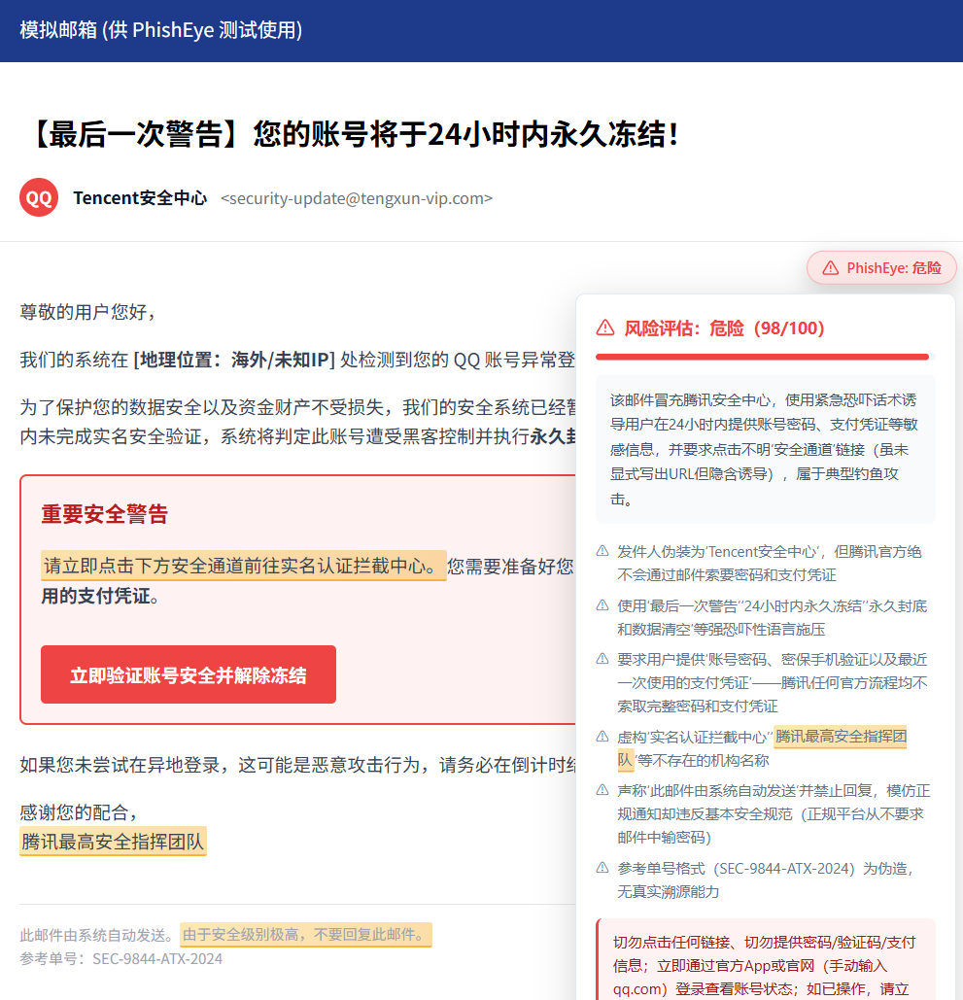
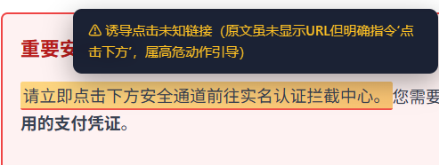
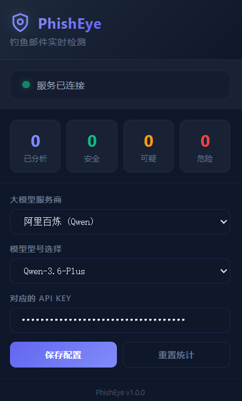

# PhishEye — 智能钓鱼邮件实时检测与无感防御系统 🛡️

PhishEye 是一款针对 QQ 邮箱的、基于 **大语言模型 (LLM)** 的浏览器插件，旨在通过深度语义分析，实时拦截钓鱼、诈骗及恶意诱导邮件，防范于未然。

相比于传统基于黑名单或简单规则的拦截系统，PhishEye 能够深度理解邮件背后的“真实意图”，识别紧急性施压话术、发件人伪装及隐蔽的欺诈跳板链接。通过引入 **后台增量静默预检** 与 **本地持久化指纹秒级匹配** 架构，PhishEye 实现了在打开邮件瞬间 **< 100ms 无感秒级载入** 检测结果的卓越体验。

---

## ✨ 核心亮点与升级

### 1. 🚀 后台增量静默自动预检
- **增量 Mutation 侦听**：使用 `MutationObserver` 结合高频定时器，实时捕捉邮件列表中新收到的动态邮件行。
- **基线防损机制 (Baseline)**：首次加载页面时自动录入现有邮件 ID 作为“安全基线”，**绝对不会对历史已有邮件发起任何多余的 AI 扫描**，最大程度节省您的 API Token 额度。
- **后台 Session 静默抓取**：自动利用当前浏览器已经登录的会话 Cookie，在后台异步拉取新邮件详情的 HTML，并在用户阅读前在后台跑完检测。

### 2. ⚡ SPA 架构无感秒级开载入 (Instant Match)
- **无 URL 变化 SPA 适配**：针对新版QQ邮箱等 SPA（单页面应用）“切换邮件时浏览器 URL 绝对不改变”的底层技术痛点，专门设计了邮件详情 DOM 渲染侦听器 `startOpenEmailMonitor`，精准捕获每一次进入/退出详情动作。
- **双重优先指纹检索**：采用“主题 + 发件人”双重特征指纹，在本地存储库中进行内容指纹 Full-Scan。
- **瞬时反馈渲染**：对于后台已经检测完的缓存，在点开的瞬间（**不到 100ms**），安全横幅、安全 Badge 以及荧光笔热力图**瞬间完成渲染**，彻底消除大模型 3~5 秒的长推理等待。

### 3. 🧩 极强QQ邮箱边界容错与净化技术
- **智能 CGI 跨域降级 (Fallback to mail.qq.com)**：解决QQ邮箱域名 `wx.mail.qq.com` 下没有部署经典 `/cgi-bin/readmail` CGI 路由产生的 404 网络拦截错误，自动降级跨域 fetch 经典 `mail.qq.com` 接口读取邮件正文，保证 100% 抓取成功率。
- **DOM 强力净化引擎 (HTML Purifier)**：在解析拉取回的 HTML 阶段，**直接物理强力拔除所有的 `<script>` 和 `<style>` 标签**。彻底解决了大模型因为解析到页面底座运行的前端配置 JavaScript 代码而误报“邮件发送原始代码和乱码”的问题。

### 4. 🔗 左右互搏双重 AI 交叉复核循环 (Actor-Critic)
- 内置兼任评审职责的 `EVALUATOR_PROMPT`。当主分析模型给出危险（dangerous）的高评判定时，自动触发 Critic（评审员）模型进行死磕复核，检查是否夸大其词或高亮词篡改原文。若不合格，会自动驳回并强迫主模型根据反馈重新评估，极大抑制幻觉与误判。
- **前置本地黑名单一击必杀**：针对极其典型的高危欺诈词（如“办理资金退出”、“安全核销”、“涉嫌洗钱及非法集资”等），首个毫秒级前置拦截，不经过网络 API 直接判定，实现零延迟、免扣费阻断。

---

## 📸 界面展示

### 1. 详细分析报告


### 2. 风险高亮提示


### 3. 设置面板


---

## 🛠️ 多模态安全防护管道

PhishEye 底层已经演进为一个标准的高级多模态过滤流水线：

```text
新邮件到达 
   │
   ├──> [ MutationObserver 增量捕捉 ] ─> (基线 Baseline 比对排重)
   │
   ├──> [ 后台 Session 静默 fetch ] ──> (跨域 404 Fallback 自动降级)
   │
   ├──> [ DOM 净化 Purifier ] ────────> (物理剔除 <script> & <style> 标签)
   │
   ├──> [ 前置绝对黑名单极速拦截 ] ───────> [判定危险 (直接缓存拦截)]
   │
   ├──> [ 大模型主评估 (Actor) ]
   │
   ├──> [ 评审员复核核验 (Critic) ] ──> (驳回重试/判定放行)
   │
   ├──> [ 持久化大容量本地存储缓存 ] ───> (phisheye_cache_ + 自动 GC 淘汰机制)
   │
打开邮件时
   │
   └──> [ SPA 详情 DOM 指纹检索 ] ───> ( < 100ms 无感瞬间着色渲染)
```

---

## 📂 项目结构

```text
extension_pure/
├── manifest.json      # 插件 MV3 配置文件
├── background.js     # Service Worker（数据缓存、大模型调用、Actor-Critic 评审、黑名单拦截）
├── content.js        # Content Script（增量邮件侦听、SPA 打开监控器、DOM 净化、三层 UI 高亮注入）
├── content.css       # 页面注入样式（Cyberpunk 风格顶部横幅、安全 Badge、荧光高亮）
├── popup.html        # 设置面板 UI（符合 Cyberpunk 暗色主题规范）
├── popup.js          # 设置面板交互（开关持久化保存、滚动数字动画、健康检查）
├── popup.css         # 设置面板样式（Slider 滑块动效、极客色彩面板）
├── icons/            # 插件图标资源
└── screenshots/      # 功能截图展示
```

---

## 🚀 快速开始

### 1. 加载 Chrome 扩展程序

1. 克隆或下载本项目到您的本地设备并解压。
2. 打开 Chrome 或 Edge 浏览器，访问 **扩展程序** 管理页面 (`chrome://extensions/`)。
3. 开启页面右上角的 **“开发者模式”** 开关。
4. 点击 **“加载已解压的扩展程序”**，选择项目的 `extension_pure` 目录即可加载成功。

### 2. 配置您的 AI 引擎

1. 点击浏览器右上角工具栏的 **PhishEye** 图标，打开设置面板。
2. 选择您的 **大模型服务商**（如阿里百炼、DeepSeek、智谱等）。
3. 输入对应的 **API Key** 以及选择相应的模型型号。
4. **个性化设定**：面板中配有 **“新邮件后台自动检测”** 的高颜值 Toggle 开关，您可以随时一键启用/禁用后台静默监控。
5. 点击 **“保存配置”**，系统会进行健康状态检查，并即刻生效。

---

## 🔒 隐私与安全性

- **100% 本地存储**：PhishEye 严格遵守安全沙盒规范，所有的统计数据（已分析、安全、可疑、危险件数）和持久化数据缓存完全存储在您浏览器本地的 `chrome.storage.local` 中，绝对不会向任何插件开发者的私有服务器上传任何邮件数据。
- **会话 Cookie 隔离保护**：后台静默拉取完全使用浏览器已有的 Sandboxed Session 进行，任何第三方网站都无法拦截或访问，确保通信信道的绝对安全与隐私合规。

---

## 📄 许可证

基于 [MIT License](LICENSE) 开源。
